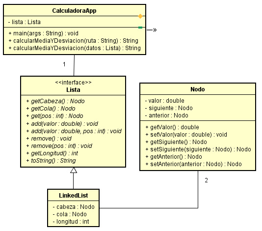

# Calculadora de media y desviación estándar con despliegue en Heroku 

## Despliegue en Heroku ##

[](https://arep-calculadora.herokuapp.com)

## Prerrequisitos ##

La persona que quiera utilizar este programa debe tener conocimientos básicos en Java y Maven. Además, es necesario tener claras las definiciones de desviación estándar y media.

Para compilar y ejecutar este programa se debe contar con las siguientes herramientas: 

- Java 8
- Maven 
- Heroku (en caso de que se quiera desplegar localmente)

## Herramientas utilizadas para el desarrollo ##

Para el desarrollo de este programa se utilizó: 

- Java: Fue el lenguaje de programación utilizado para el desarrollo.

- Spark: Librería de Java que se utilizó para montar nuestra API REST.

- Maven: Fue la herramienta utilizada para la gestión y construcción del programa.

- Heroku: Fue la herramienta que se utilizó para desplegar el programa.

## Descripción ## 

Este programa fue diseñado para calcular la media y la desviación estándar de los datos que se le ingresen mediante un archivo de texto plano (.txt) o mediante un formulario de una página web. El usuario que quiera ejecutarlo con el archivo de texto deberá ingresar la ruta de este, donde se encuentran linea por linea los datos de los cuales quiere conocer su media y desviación estándar. Por otro lado, si se quiere utilizar la página web, el usuario solo deberá ingresar los datos (separados por comas) en la página web y luego presionar el botón "calcular".

Para el cálculo de la media, que es el valor promedio de un conjunto de datos, se utilizó la siguiente fórmula: 


Por otro lado, para el cálculo de la desviación estándar, que es la medida desperción de los datos con respecto a la media, se utilizó la siguiente fórmula:


## Modelo ##


Se implementó una lista doblemente enlazada que permite: agregar, eliminar y obtener cualquier elemento de la lista en tiempo lineal. Esta lista fue utilizada por una clase principal que: lee los datos, los almacena en una lista, realiza los cálculos y, finalmente, entrega por pantalla la respuesta al usuario.

En el repositorio se encuentra un archivo [Pdf](LAB_02.pdf) que explica más a profundidad el diseño del programa.

## Instrucciones para su compilación, ejecución y generación de documentación ##

Para compilar el programa, se debe primero ubicar en la carpeta del archivo y posteriormente ejecutar el siguiente comando: 

```
   mvn package 
```

Una vez compilado el programa, lo siguiente es ejecutarlo. Para esto, otra vez ubicado en la carpeta del programa, ejecute el siguiete comando:

```
   mvn exec:java -Dexec.mainClass="edu.eci.arep.CalculadoraApp" -Dexec.args=*coloque entre comillas aquí la ruta de su archivo txt.*
```
(Para el correcto funcionamiento del programa, el archivo txt. debe tener cada uno de los datos en distintas lineas consecutivas del archivo)

Por otra parte, si se prefiere levantar el servidor web y utizarlo mediante su página web, se deberá ejecutar el siguiente comando:

```
   heroku local web
```
 
(**NOTA:** Si se encuentra en un computador con SO Windows, primero deberá cambiar, antes de ejecutar el comando anterior, la linea que se encuentra en el Procfile por la siguiente:

```
web: java -cp target/classes;target/dependency/* edu.escuelaing.arep.designprimer.SparkWebApp
```

si no lo hace, el comando anterior no funcionará)
 

Si desea generar una nueva documentación del programa, debe ejecutar la siguiente lista de comandos:

```
   mvn javadoc:javadoc
   mvn javadoc:jar
   mvn javadoc:aggregate
   mvn javadoc:aggregate-jar
   mvn javadoc:test-javadoc
   mvn javadoc:test-jar
   mvn javadoc:test-aggregate
   mvn javadoc:test-aggregate-jar
```

Vale recalcar que el programa ya cuenta con archivos de documentación ubicados en la carpeta "Documentacion".

## Licencia ## 

La licencia de este proyecto es: [**GNU General Public License v3.0**](LICENSE)

## Autor ##

Julián David Gutiérrez Vanegas
